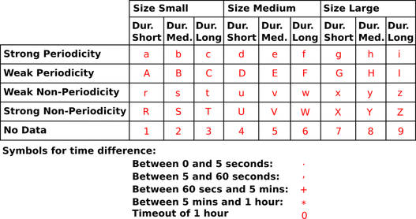
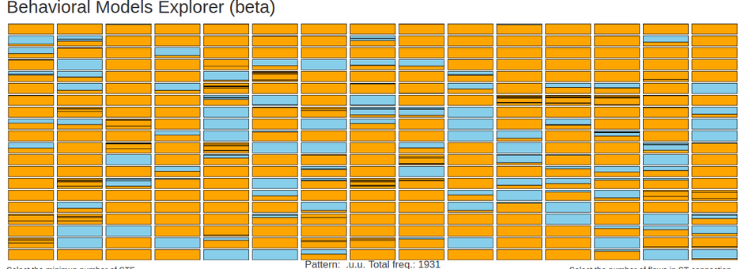

# **stf-pattern-viz**

## A tool for visually analize the discriminative power of STF behavioral models

### Stratosphere Project

The Stratosphere Project aims at detecting the behavioral patterns of malicious connections in unknown networks by modelling the behaviors of known malicious traffic.  

This blog post is a theoretical description of how the behaviors are represented and interpreted before any detection algorithm is implemented. We refer to this as the disassociation between the representation of the model and the detection of the model.

### Behavioral Models

Behavioral models of malicious connections in the network are created by  studying the long term characteristics of the network traffic. This kind of models have been implemented inside the Stratosphere Intrusion Prevention System (IPS), which is a large effort for offering a state of art IPS for Non Governmental Organizations (NGO).  
The  approach used by  Stratosphere IPS to model the behavior of a connection, starts by aggregating the flows according to a 4-tuple composed of: the source IP address, the destination IP address, the destination port and the protocol. All the flows that match a tuple are aggregated together and referred as a *Stratosphere connection*. From a traffic capture several of these Stratosphere connections are created. Each one of the these Stratosphere connections contains a group of flows. The behavior of a connection is computed as follows:

* Extract three features of each flow: size, duration and periodicity.
    
* Assign to each flow a \textit{state} symbol according to the features extracted and the assignment strategy shown in Table below
    
* After the assignment, each *connection* has its own string of symbols that represents its behavior in the network.

  

An example of these **behavioral models** is shown below. The figure shows the symbols representing all the flows for a  **Stratosphere connection** based on UDP protocol from IP address *10.0.2.103* to port 53 of IP address 8.8.8.8.

####  2.4.R,R.R.R,a,b,a.a,b,b,a,R.R.R.R.a.a.b.a.a.a.a.
    
Without even considering any **detection method**, the **behavioral models** based on symbols have proved to be a good visualization approach for helping security analysts in their daily tasks.

### The STF-pattern-viz tool

Before developing any new detection method, good data science practices suggest to analize the potential discriminative power of the symbol-based behavioral models described above. With that purpose in mind, we developed *stf-pattern-viz*. The idea behind *stf-pattern-viz* is quite simple, given a dataset with labeled behavioral models, we extract all the *n-grams* from the dataset. The size of *n* can vary from 1 to 100. Then, the app will provide information about three aspects for all the considered *n-grams* . 

The aspects considered are basically:

1. The number of times a given *n-gram* is observed.

2. The number of times a given *n-gram* is observed in different behavioral models

3. The labels of the models where the *n-gram* was observed

  

Such information mainly is provided using visualization tools in the following way: 

1. Each *n-gram* is represented by a rectangle. Right now the app shows only the first 300 *n-gram*

2. A subdivision inside the rectangle indicates the same *n-gram* was seen in different behavioral models. The more subdivisions, the more observations of the *n-gram* pattern in different behavioral models.

3. By default, normal behaviors are represented in Blue while Malicious in Orange. 

By using this simple strategy you can have an idea about the discriminative power of *n-ngrams* in a given dataset. Clearly, a rectangle painted with only one color indicates that particular pattern was only observed in one behavioral models with the same label. On the other side, a rectangle painted with different colors indicates class overlaping for that particular pattern.

#### Detailed View

If you click inside any rectangle you will access to detailed information about this particular *n-gram*. In the bottom of the screen, an Frequency histogram for the selected *n-gram* is shown. There you will find information about the different behavioral models where that *n-gram* pattern was observed.

#### Filtering *n-grams*

The application support some basic pattern filtering.

1. Filter *n-grams* of size *n*

2. Filter *n-grams* observerd at least *x* times

3. Filter *n-grams* observed at least in *y* different behavioral models.

By default the applications will consider all the behavioral models present in the dataset. However it is possible to filter by using the **Label** information. 
Additionally, it is possible to filter by **Label**. Since the standard STF **Label** contains information regarding the different protocol layers, it then possible to filter by protocol layer 4 or 5. Such filtering is done by using standard regular expressions. Finally, it is also possible to select the what portion of the label you want to discriminate. By default the idea behing the blue and orange schem colors is to differentiate between **Normal** and **Malicious**. However, you are not restricted to only this differention. If you want to use the color scheme for discriminating between, for instance, DNS traffic DGA and Normal, you can do it easily using regular expressions.   

### Live Demo
By now, a live demo is available at (https://harpomaxx.shinyapps.io/stf-pattern-viz/). This demo contains a subset of the [CTU-13 Dataset](http://mcfp.weebly.com/the-ctu-13-dataset-a-labeled-dataset-with-botnet-normal-and-background-traffic.html). Some minor modifications were made in the label description for facilitating the aggregation. A detail about the label modification and how the CTU-13 subset was generated is found [here](http://rpubs.com/harpomaxx/ctu13bis)

### Including your own dataset
[TODO]
